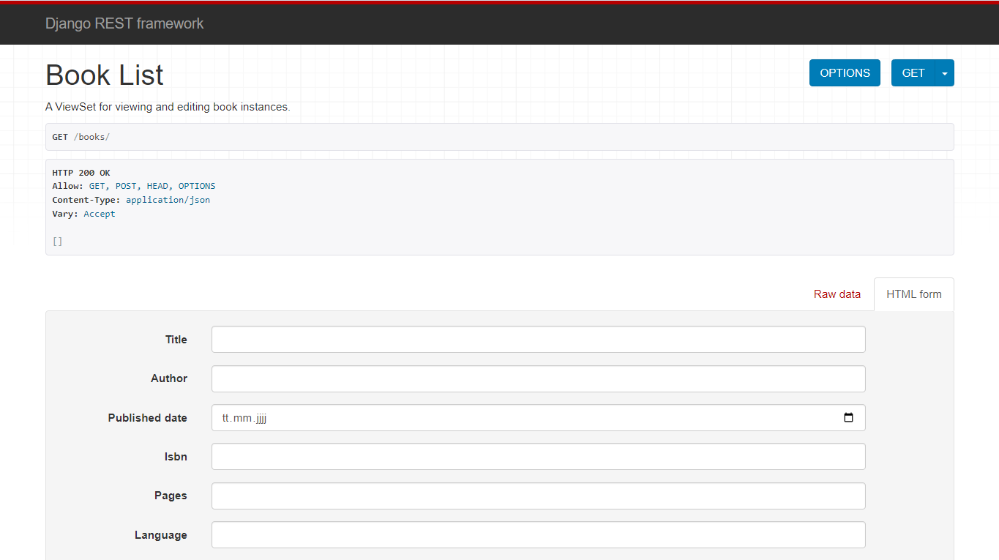

# Backend API with Django

## Overview
This project is a demonstration of a RESTful API built using Django and Django REST Framework (DRF). It provides an interface to manage a library's collection of books. 

## API Test Screenshot

Below is a screenshot of the response from the **GET `/books/`** endpoint using Postman:




## Features
- User Authentication using JWT.
- CRUD operations for managing books.
- Pagination and filtering for book listings.

## Technologies
- Django
- Django REST Framework
- SQLite (default database, customizable)
- Python 3.8+

## Installation

### Prerequisites
- Python 3.8 or higher installed.
- Pip package manager.

### Steps
1. Clone the repository:
   ```bash
   git clone https://github.com/your_username/backend_api_with_django.git
   cd backend_api_with_django


[def]: docs/images/postman_response.png